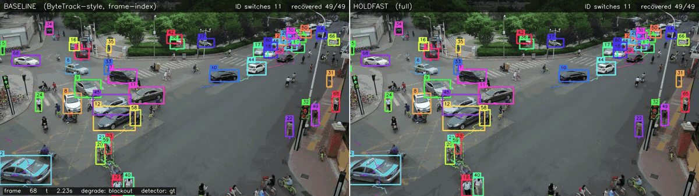
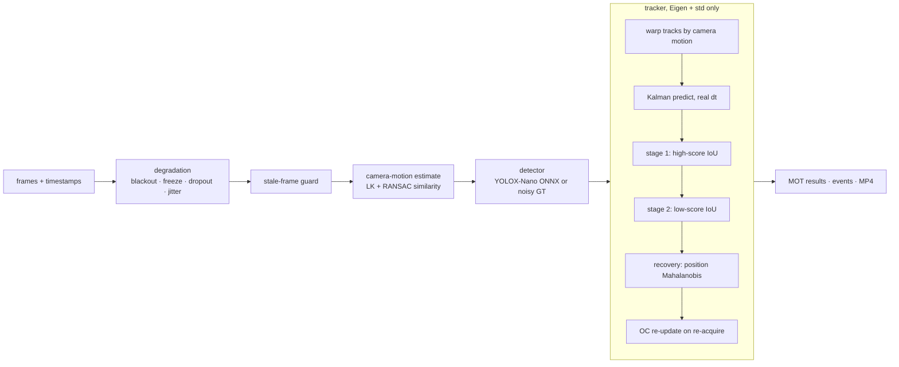

# Holdfast

A C++20 multi-object tracker for drone video that **keeps each object's identity when the
picture breaks up** (frame blackouts, frozen feeds, detection dropout, timestamp jitter) and
**while the camera itself moves**. Headless, CPU-only, runs in a 242 MB Linux container on
x86 or ARM64.



*Same degraded input on both sides. During the blackout the baseline's boxes freeze in
place (it thinks one frame passed); Holdfast's keep moving and their dashed 2σ uncertainty
grows. When video returns, the baseline has gone from 12 to 29 ID switches; Holdfast stays at 13.*

## Results

VisDrone2019-MOT val (7 sequences, moving drone camera, median 12–48 evaluated objects per frame), detections
from ground truth plus seeded noise so the table measures the **tracker**, not the detector
([why](docs/design-notes.md#8-why-the-eval-uses-ground-truth--noise)). Scored with TrackEval.
Full tables, held-out split and all ablations: [`results/summary.md`](results/summary.md).

| input | tracker | HOTA | IDF1 | ID switches |
|---|---|---:|---:|---:|
| **clean** | baseline (ByteTrack-style) | 62.5 | 74.9 | 766 |
| | OC-SORT (reference) | 52.3 | 68.8 | 671 |
| | **Holdfast** | **69.0** | **83.5** | **255** |
| **blackout** (15–30 frames lost every ~4 s) | baseline | 42.9 | 52.7 | 791 |
| | OC-SORT | 37.2 | 49.8 | 650 |
| | **Holdfast** | **50.5** | **64.4** | **355** |
| **freeze** (feed repeats a frame for 10–20 frames) | baseline | 49.4 | 58.2 | 930 |
| | OC-SORT | 41.2 | 51.2 | 883 |
| | **Holdfast** | **59.5** | **74.2** | **338** |
| **heavy** (blackout + freeze + 30% dropout + jitter) | baseline | 32.0 | 43.1 | 977 |
| | OC-SORT | 14.5 | 23.9 | 757 |
| | **Holdfast** | **38.9** | **55.7** | **361** |

**What each piece buys** (HOTA lost when it is removed from the full tracker):

| removed | clean | blackout | freeze | heavy |
|---|---:|---:|---:|---:|
| camera-motion compensation | −6.5 | −3.6 | −4.2 | −4.2 |
| timestamp-based dt | 0.0 | −2.7 | 0.0 | −1.5 |
| recovery stage | −0.3 | −1.8 | −2.0 | −1.0 |
| stale-frame guard | 0.0 | 0.0 | −4.3 | −0.4 |
| OC-SORT re-update | −0.4 | −0.2 | +0.1 | +0.2 |

Each piece helps exactly where it should and nowhere else. The OC-SORT re-update is
**neutral** on this data; it is kept (cheap, has a unit test for the case it fixes) and
reported as such.

**How to read this honestly**

* Every design decision was tuned on 3 **dev** sequences; the other 4 were **held out** and
  scored once. Held-out results match dev (e.g. blackout: 44.0 → 50.9 HOTA).
* OC-SORT runs on the byte-identical detection stream, is told about missing frames, and had
  its threshold tuned on the same dev set. Its gap is mostly **no camera-motion compensation**
  (its paper doesn't use it) and its output rule (a track is reported only after 3 consecutive
  hits, so every missed detection hides it for 3 frames). This is not a claim that Holdfast
  is a better general-purpose tracker.
* **Reproducible:** same seed gives byte-identical result files, and macOS/Clang and
  Linux/GCC (both arm64) produce identical detections and tracks (the RNG distributions
  are implemented by hand because `std::` distributions differ between standard libraries).
* One design choice was reversed by the numbers: a Mahalanobis gate on the first matching
  stage *cost* ~3 HOTA and was removed ([details](docs/design-notes.md#4-association-bytetrack-style-plus-recovery)).

## Latency

Full onboard pipeline with the real detector (JPEG decode → camera-motion estimate →
YOLOX-Nano via ONNX Runtime → tracker), 300 frames of 1344×756 video (`uav0000086_00000_v`).

| platform | cores | decode | CMC | detect | track | end-to-end |
|---|---:|---:|---:|---:|---:|---:|
| linux/arm64 container (Apple M4 host) | 1 | 3.8 ms | 10.5 ms | 21.9 ms | 0.02 ms | **26 fps** |
| linux/arm64 container (Apple M4 host) | 2 | 3.2 ms | 5.9 ms | 14.5 ms | 0.02 ms | **39 fps** |
| macOS arm64 native (Apple M4) | 1 | 2.5 ms | 7.6 ms | 19.0 ms | 0.02 ms | **32 fps** |
| macOS arm64 native (Apple M4) | 2 | 2.1 ms | 3.8 ms | 12.3 ms | 0.02 ms | **53 fps** |
| x86_64 (Dell OptiPlex 7050) | 1 / 2 | *to run* | | | | |

Stage times are p50. The tracker itself is **0.09 ms** per frame on the densest sequence
(~50 detections per frame, ground-truth detector); the detector is ~2/3 of the budget, so it is the thing
to move to TensorRT/INT8 on a Jetson.

To fill the x86 row: `docker build -t holdfast . && docker run --rm --cpus=1 -v $PWD/data:/data -v $PWD/models:/models holdfast --source /data/VisDrone2019-MOT-val/sequences/uav0000086_00000_v --model /models/yolox_nano.onnx --frames 300 --threads 1`

## How it works



* **Kalman filter** over `[cx, cy, w, h, vx, vy, vw, vh]` with velocities in px/s and
  `predict(dt)` from real timestamps. A blackout is one big `dt`, not a missing index.
* **Camera-motion compensation**: frame-to-frame similarity transform from sparse optical
  flow + RANSAC, applied to every track's mean and covariance before prediction (BoT-SORT's idea).
* **ByteTrack two-stage association** with an own Hungarian solver (tested against brute force).
* **Recovery** of Lost tracks by position Mahalanobis distance: the covariance grows while
  unseen, so the search gate widens on its own.
* **Track lifetime in seconds** (1.5 s), not frames.
* **Stale-frame guard**: a frozen feed is detected and treated as predict-only.

Design reasoning, the math, and the failure modes: [`docs/design-notes.md`](docs/design-notes.md).

## Quick start

```bash
# dependencies (macOS: brew install cmake ninja eigen googletest ffmpeg)
./scripts/build_opencv_min.sh        # minimal static OpenCV into .deps/ (~50 MB)
./scripts/fetch_onnxruntime.sh       # prebuilt ONNX Runtime into .deps/
./scripts/fetch_model.sh             # YOLOX-Nano into models/
./scripts/fetch_visdrone.sh          # VisDrone MOT val (1.5 GB) into data/

cmake --preset release && cmake --build --preset release && ctest --preset release

./scripts/demo.sh                    # side-by-side baseline vs Holdfast, blackout, opens the MP4

./scripts/fetch_eval_deps.sh         # TrackEval + OC-SORT
.venv/bin/python eval/sweep.py       # regenerates results/summary.md (seeded, deterministic)
```

One sequence, your choice of trackers and degradation:

```bash
build/release/holdfast_run \
  --source data/VisDrone2019-MOT-val/sequences/uav0000117_02622_v \
  --gt data/VisDrone2019-MOT-val/annotations/uav0000117_02622_v.txt \
  --configs baseline,cmc,full --degrade heavy --seed 42 \
  --out-dir results/try --render results/try.mp4
```

Docker (x86_64 or ARM64): `docker build -t holdfast .`; `docker build --target asan .`
runs the core tests under ASan + UBSan.

## Layout

```
include/holdfast/         core headers (Eigen + std only)
  kalman.hpp hungarian.hpp tracker.hpp degrade.hpp gt_detector.hpp rng.hpp ...
  app/                    OpenCV / ONNX Runtime layer: image source, CMC, detector, renderer
src/                      implementations
apps/                     holdfast_run, holdfast_bench
tests/                    GoogleTest: 29 core + 3 app tests
eval/                     TrackEval wrapper, OC-SORT runner, sweep
scripts/                  dependency, data, demo and GIF scripts
docs/                     design notes, sequences, GIF
```

## Status and known gaps

* **Accuracy numbers use ground-truth detections with injected noise.** With the real
  COCO-trained YOLOX-Nano, tiny aerial objects are often missed; every row would drop.
  The real detector is used for latency and demo footage only.
* **No appearance model.** An HSV-histogram embedding was planned and dropped: on 10–20 px
  objects it carries almost no signal. A learned ReID is the next step.
* **CMC is image-only.** It falls back to identity when the scene is textureless or the gap
  is too long (logged as `cmc-fallbacks`). An IMU/gimbal feed would remove that failure mode.
* **Frame rate is assumed** (30 fps); VisDrone image sequences carry no timestamps.
* **x86 latency row** is not filled yet (needs the OptiPlex).
* ASan does not run on macOS 26 with the current Apple toolchain (hangs on hello-world);
  it runs in the Linux Docker stage and in CI instead.

## What I'd do next

* Learned ReID (e.g. OSNet-x0.25 in ONNX) in the recovery stage, with its ms/frame cost measured.
* TensorRT + INT8 detector on a Jetson.
* IMU-aided camera-motion compensation.
* A detector fine-tuned on VisDrone, and evaluation with it.
* Bazel build; protobuf/gRPC track output.

## Licences

Code: MIT. YOLOX weights: Apache-2.0 (Megvii). OC-SORT (evaluation only, fetched, not
vendored): MIT. TrackEval: MIT. VisDrone: academic use only, not redistributed here.
